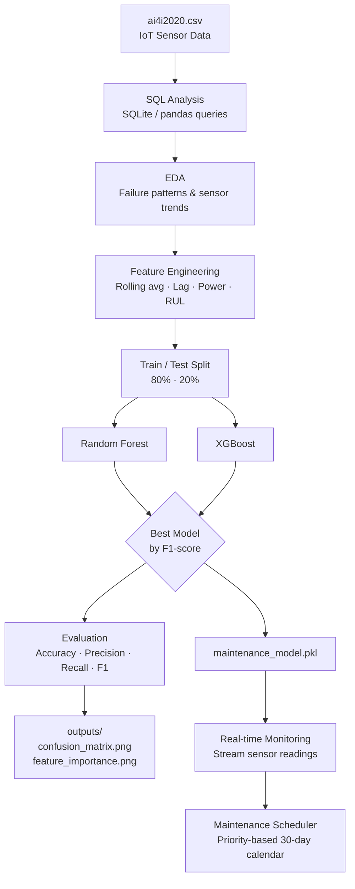
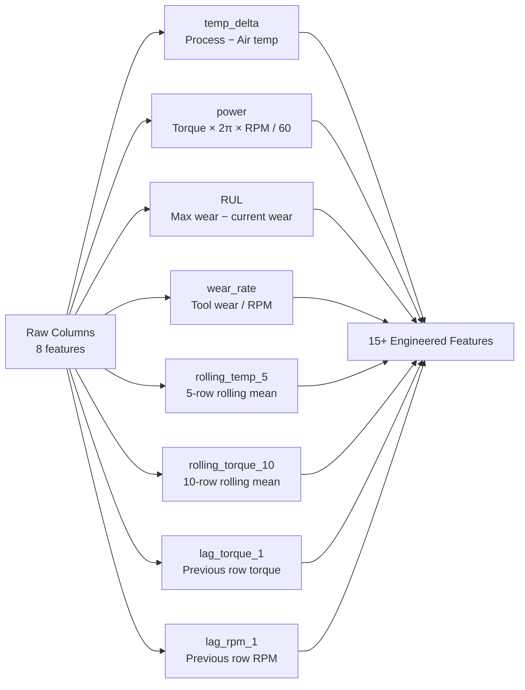
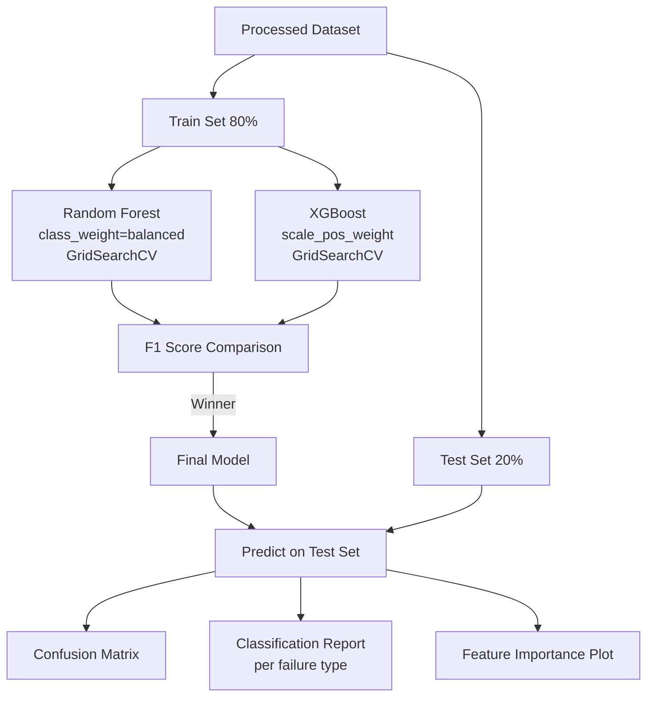
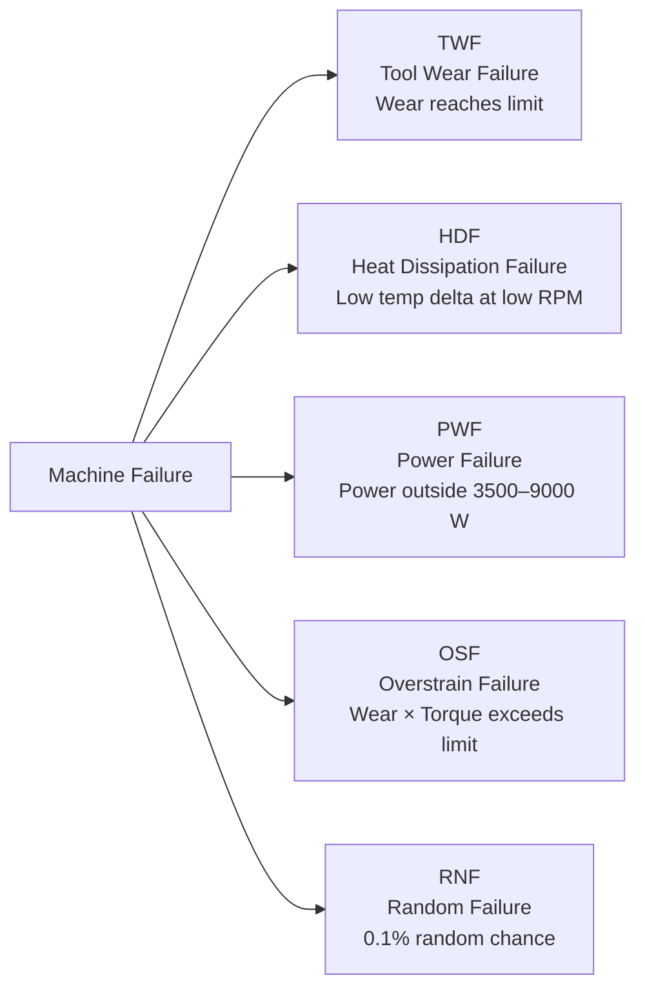
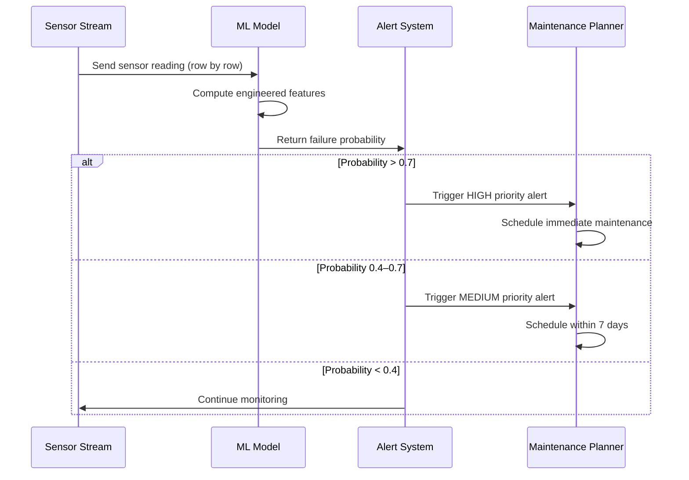

# System Architecture

## Pipeline Overview

```mermaid
flowchart TD
    A[ai4i2020.csv\nIoT Sensor Data] --> B[SQL Analysis\nSQLite / pandas queries]
    B --> C[EDA\nFailure patterns & sensor trends]
    C --> D[Feature Engineering\nRolling avg · Lag · Power · RUL]
    D --> E[Train / Test Split\n80% · 20%]
    E --> F[Random Forest]
    E --> G[XGBoost]
    F --> H{Best Model\nby F1-score}
    G --> H
    H --> I[Evaluation\nAccuracy · Precision · Recall · F1]
    H --> J[maintenance_model.pkl]
    I --> K[outputs/\nconfusion_matrix.png\nfeature_importance.png]
    J --> L[Real-time Monitoring\nStream sensor readings]
    L --> M[Maintenance Scheduler\nPriority-based 30-day calendar]
```

---

## Feature Engineering

```mermaid
flowchart LR
    A[Raw Columns\n8 features] --> B[temp_delta\nProcess − Air temp]
    A --> C[power\nTorque × 2π × RPM / 60]
    A --> D[RUL\nMax wear − current wear]
    A --> E[wear_rate\nTool wear / RPM]
    A --> F[rolling_temp_5\n5-row rolling mean]
    A --> G[rolling_torque_10\n10-row rolling mean]
    A --> H[lag_torque_1\nPrevious row torque]
    A --> I[lag_rpm_1\nPrevious row RPM]
    B & C & D & E & F & G & H & I --> J[15+ Engineered Features]
```

---

## ML Model Architecture

```mermaid
flowchart TD
    A[Processed Dataset] --> B[Train Set 80%]
    A --> C[Test Set 20%]

    B --> D[Random Forest\nclass_weight=balanced\nGridSearchCV]
    B --> E[XGBoost\nscale_pos_weight\nGridSearchCV]

    D --> F[F1 Score Comparison]
    E --> F

    F -->|Winner| G[Final Model]
    G --> H[Predict on Test Set]
    C --> H

    H --> I[Confusion Matrix]
    H --> J[Classification Report\nper failure type]
    H --> K[Feature Importance Plot]
```

---

## Failure Types

```mermaid
flowchart LR
    A[Machine Failure] --> B[TWF\nTool Wear Failure\nWear reaches limit]
    A --> C[HDF\nHeat Dissipation Failure\nLow temp delta at low RPM]
    A --> D[PWF\nPower Failure\nPower outside 3500–9000 W]
    A --> E[OSF\nOverstrain Failure\nWear × Torque exceeds limit]
    A --> F[RNF\nRandom Failure\n0.1% random chance]
```

---

## Real-time Monitoring Flow

```mermaid
sequenceDiagram
    participant S as Sensor Stream
    participant M as ML Model
    participant A as Alert System
    participant P as Maintenance Planner

    S->>M: Send sensor reading (row by row)
    M->>M: Compute engineered features
    M->>A: Return failure probability
    alt Probability > 0.7
        A->>P: Trigger HIGH priority alert
        P->>P: Schedule immediate maintenance
    else Probability 0.4–0.7
        A->>P: Trigger MEDIUM priority alert
        P->>P: Schedule within 7 days
    else Probability < 0.4
        A->>S: Continue monitoring
    end
```
